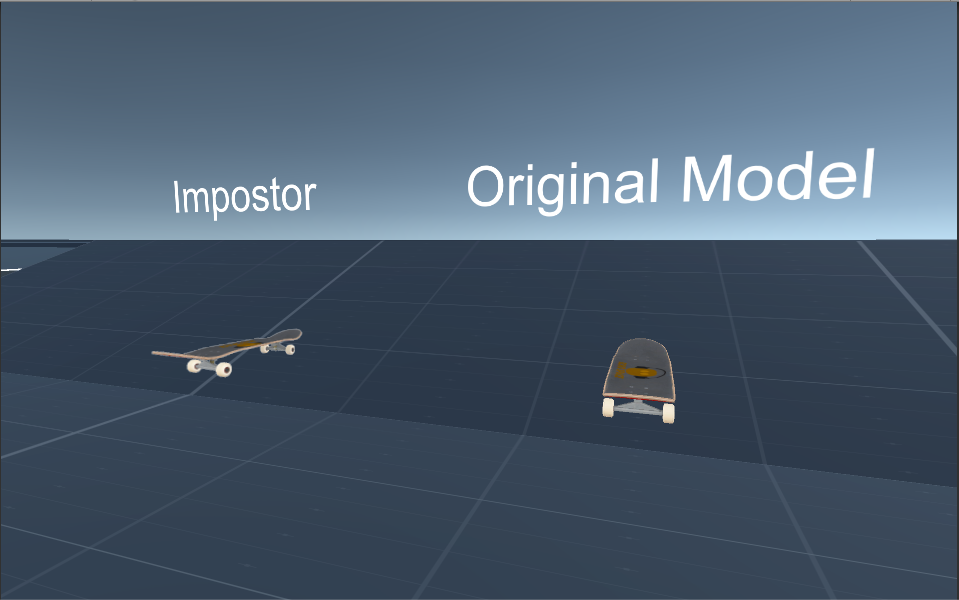

# AltspaceVR Programming Project - Impostor Rendering

# Part 1 - Realtime Impostor

## Goal : Realtime generation and rendering of Impostor texture

Dynamically generates impostor textures from given mesh object(Skateboard). 
The impostor texture is updated due to relative movement of impostor target object from the viewing camera.

Impostor mesh is not updated when the camera viewing angle to the impostor does not exceed the defined threshold(Angle Threshold).
Original threshold is set to 0.02. As the threshold is increased, the impostor does not be updated frequently and cause some artifacts which comes from angle difference between the camera angle of current view and camera angle of render texture.

Target object which is to be rendered with the impostor is initially set to the Skateboard object, but you can change the target object using parameter box of Inspector or source code of _ImpostorController.cs_.

## Parameters
* Angle Threshold(float) : Threshold for selective update. Until the angle difference of impostor view is exceed this threshold, rendering update is not processed.
* Texture Size(int) : Size of RenderTexture

## Files Included : 
* TextureManager.cs : Container class of RenderTexture and Camera for Texture rendering
* ImpostorController.cs : Main Controller class which assigns TextureManager and update camera position
* AlphaShader.shader : Alpha shader for the render texture composition

## Usage
1. Create Quad object to be rendered with impostor
2. Link the _ImpostorController.cs_ script to the quad object. (If you don't want to many objects, disable _"MultiImposer"_ class.
3. Set the parameter and excute

## Issues
When the camera is closer than certain distance, imposter rendered object can be vanished. This is due to the render texture property of unity engine, but this does not happens when at least 2m distance is allowed(which is mentioned in problem condition).

If you set the texture resolution too low, some artifact like aliasing and blur can be seen. In my calculation, over than 400 pixels render texture does not show distinct artifacts.

# Part 2 - Enhancements : Massive objects Generation using Faster Impostor Rendering
## Goal 
Enhancement of performance for rendering massive objects using Impostor rendering and selectively update policy.
In this part, the massive number of objects can be rendered with the impostor rendering to test performance of massive rendering.
Additional methods for performance enhancement are applied and test the result of performance.

## Enhancement Algorithm
Rendering performance enhancement is performed while only rendering necessary impostor and using pre-rendered impostor cache. Detailed policy applied is as below.

* Adaptive Resolution : In rendering massive objects, far objects from view position does not requires high-resolutional impostor texture. With calculation of viewing angle from view point, the impostor texture resolution in far object is reduced. This operation does not support dynamic resolution change since dynamic resizing of _RenderTexture_ in Unity Engine requires additional performance burden.
* Angle Threshold : The same method which is applied to previous single impostor. Skip impostor rendering update when movement of view position is lower than the threshold.
* Frustum Culling : Check if the certain impostor are in the camera frustum and if not, do not update the impostor runtime.
* Pre-rendered Texture Caching : Loads pre-generated texture and use for the impostor rendering instead of dynamically rendering online.

## Parameters
* Target Obj : A mesh object to be rendered with impostor. Default value is the _Skateboard_ object.
* Adaptive Resolution : Turn on/off adaptive resolution method. This method only effect when the program start.
* View Angle Update : View angle threshold method for selective update of impostor.
* Use Cache : loading a pre-rendered texture image and texture mapping instead of dynamic generation.
* Falling Object : Check if the massive objects are falling or not.
* Angle Threshold(float) : Threshold for selective update.
* Cache Angle Threhold : Threshold for texture cache. 
* Object Number : The number of objects to be rendered with impostor
* Positioning Method : The way of massive objects positioning. 
Uniform : uniformly positioned / Random2D : randomly positioned in ground plane / Random3D : randomly positioned in 3D space

## Files Included : 
* MultiImpostorController.cs : Impostor Controller Class which assigns Multiple TextureManager and update camera position
* UtilFun.cs : Function implementation for additional utility function and parameter setting
* PrintoutImpostorTexture.cs : Pre-generate cache texture for impostor

## Usage

1. Texture Generation_(Optional)_ : Turn on the _Printout Texture_ of _GenerateCacheTex.cs_ which is attached to _GenerateCacheTex_ game object. The code will generate _impostorCacheTex.png_ file to the home location. Please beware that the pre-generation of impostor rendering requires much time. Texture cache properties are listed in _UtilFun.cs_ _TextureCacheInfo_ class. Texture Size and Cache range, cache resolution are defined.
2. Massive Object Rendering : Input the number of objects to rendered in _Object Number_ at _MultiImpostorController_ script and
choose the positioning method among the Uniform/Random2D/Random3D
3. Enhancement Feature Selection : select additional enhancement for the performance and excute it
 : _Adaptive Resolution / View Angle Update / Frustum Culling / Use Cache_

## Issues
* Enhancement Efficiency : _Adaptive Resolution_ enhance efficiency significantly and _View Angle Update_ increases performance of impostor rendering. However, _Frustum Culling_ does not shows distinct difference in framerate. That's because unity3D engine does culling algorithm by itself and manual culling does not effects well. 
* Cache Resolution : The pre-rendered texture is used for cache of impostor rendering, but there exists popping artifacts when the pre-rendered angle and current angle has difference. I set the angle threhold for caching as _1.0_, but it can be increased when you want to get more performance.
    
## Acknowledgements
* Scene Files from AltspaceVR 

## Contact
All the source code are from Jong Pil Park(jpster99@gmail.com)
